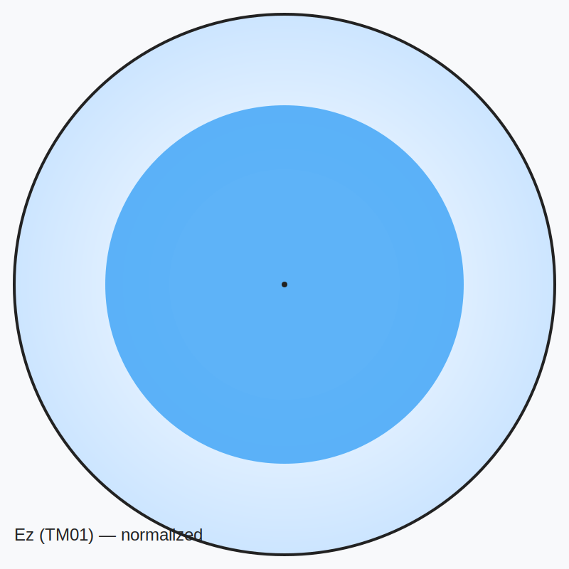
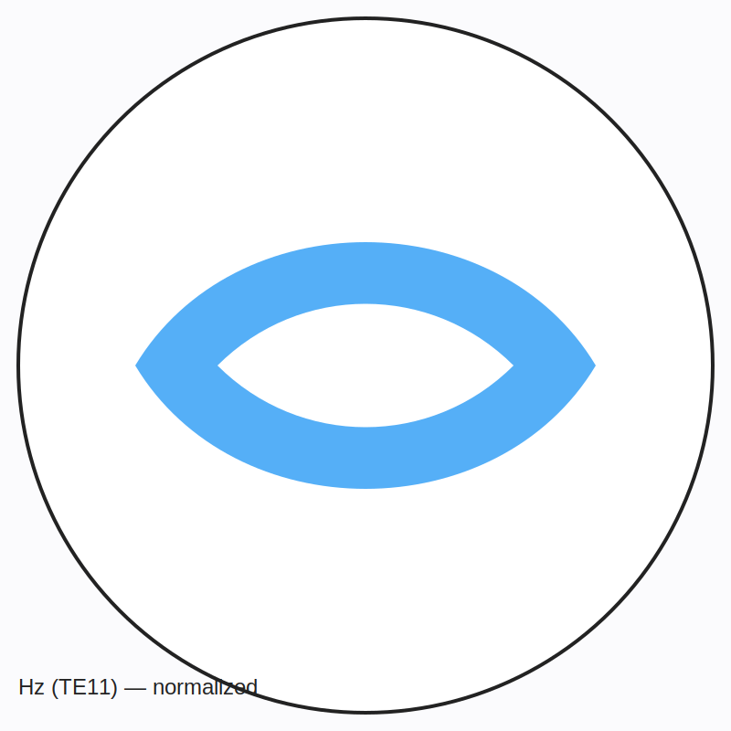
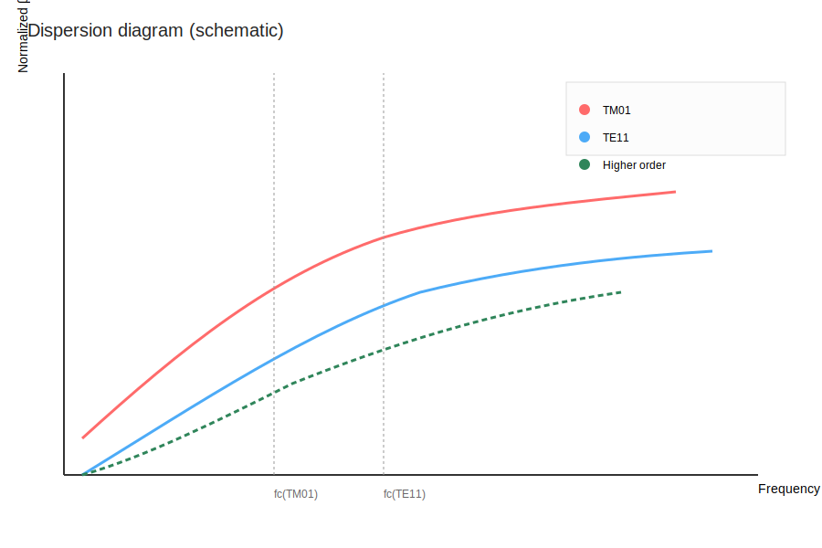

# TM and TE waves in a circular waveguide

Comprehensive study of TM and TE modes in circular waveguides with theory, equations, and Python programs to compute cutoff frequencies, generate dispersion diagrams, and plot electromagnetic field patterns.

This repository includes:
- Python programs to compute Bessel roots, cutoff frequencies and dispersion curves (scripts/).
- Plot scripts that generate field pattern images (Ez for TM, Hz for TE) and dispersion diagrams.
- Example images (generated by the scripts) stored in `images/` (sample SVGs have been added).
- A concise explanation of theory and usage instructions so students and RF engineers can reproduce the figures.

Preview sample images (committed to the repo):

- TM01 field (Ez) — sample SVG committed and embedded below



- TE11 field (Hz) — sample SVG committed and embedded below



- Dispersion diagram — sample SVG committed and embedded below



---

Table of contents
- About
- Theory (short)
- Files in this repo
- Requirements
- Quick start: Generate plots and figures
- Examples
- How the programs work (brief)
- Contributing
- License

About
-----
This project demonstrates TM and TE modes in an ideal circular waveguide of radius a. The included scripts compute modal cutoff frequencies using Bessel function roots, plot dispersion diagrams, and render simple field patterns in cross-section.

Theory (short)
--------------
- For a circular waveguide of radius a, the transverse wavenumber kc is determined by zeros of Bessel functions:
  - TM modes (Ez != 0): kc = x_mn / a, where x_mn is the nth zero of Jm (Bessel function of first kind).
  - TE modes (Hz != 0): kc = x'_mn / a, where x'_mn is the nth zero of the derivative Jm'(x).
- Cutoff angular frequency:
  - omega_c = c * kc / sqrt(ε_r * μ_r)
- Cutoff frequency (Hz):
  - f_c = c * kc / (2π sqrt(ε_r μ_r))
- Propagation constant (axial):
  - beta(ω) = sqrt((ω^2 μ ε) - kc^2) (real for propagating modes, imaginary for evanescent)

Files in this repo
------------------
- README.md (this file)
- scripts/compute_modes.py — compute and print or save modal zeros and cutoff frequencies
- scripts/plot_dispersion.py — plot dispersion diagram for selected modes and save image
- scripts/plot_fields.py — render cross-sectional field patterns and save images
- requirements.txt — Python dependencies
- images/ (directory for generated SVG/PNGs). Sample files added:
  - images/tm_0_1_field.svg
  - images/te_1_1_field.svg
  - images/dispersion_diagram.svg

Requirements
------------
- Python 3.9+
- numpy
- scipy
- matplotlib

Install (recommended in a virtual environment)
```bash
python -m venv .venv
source .venv/bin/activate   # Windows: .venv\Scripts\activate
pip install -r requirements.txt
```

Quick start: Generate plots and figures
--------------------------------------
1. Compute modes and cutoff frequencies (example: radius a = 0.02 m, relative permittivity = 1)
```bash
python scripts/compute_modes.py --radius 0.02 --modes 3 --zeros 3 --epsilon_r 1 --mu_r 1 --save csv --out results/modes_a0.02.csv
```
2. Generate dispersion diagram (saves images/dispersion_diagram.png)
```bash
python scripts/plot_dispersion.py --radius 0.02 --modes "TM:0-2,TE:1-2" --f_min 0.5e9 --f_max 20e9 --epsilon_r 1 --mu_r 1 --out images/dispersion_diagram.png
```
3. Plot field patterns (e.g., TM01 and TE11)
```bash
python scripts/plot_fields.py --radius 0.02 --mode TM 0 1 --out images/tm_0_1_field.png
python scripts/plot_fields.py --radius 0.02 --mode TE 1 1 --out images/te_1_1_field.png
```

Examples
--------
Below are the embedded sample images now present in the repository.


How the programs work (brief)
-----------------------------
- compute_modes.py
  - Uses scipy.special.jn_zeros and jnp_zeros to find Bessel function roots for TM (Jm) and TE (Jm' derivative) modes respectively.
  - Converts roots to kc, then to cutoff frequencies and wavelengths.
  - Outputs a human-readable table and can save CSV.

- plot_dispersion.py
  - For each requested mode, calculates the modal cutoff kc and computes beta over a frequency sweep.
  - Plots beta/k0 (or beta) vs frequency and highlights cutoff.
  - Saves PNG figures.

- plot_fields.py
  - Builds a Cartesian grid, converts to polar coordinates (r, theta).
  - Evaluates the axial field (Ez for TM, Hz for TE) as Jm(kc * r) * angular dependence (cos(m theta) or sin).
  - Normalizes and plots a filled contour with the waveguide circle boundary.

Contributing
------------
Contributions, corrections, or requests for additional features (e.g., lossy walls, dielectric-filled waveguides, 3D visualizations) are welcome. Please open an issue describing the change you'd like to propose or submit a pull request with tests and documentation.

License
-------
MIT

Acknowledgements and references
-------------------------------
This project uses scientific Python libraries and standard references for waveguide theory. Below are suggested references and resources useful for learning more or verifying formulas used in the scripts.

References
1. Pozar, D. M., Microwave Engineering, 4th ed., John Wiley & Sons, 2011. ISBN: 978-0470631553. A widely used textbook with clear coverage of waveguide modes, cutoff frequencies, and dispersion.
2. Collin, R. E., Field Theory of Guided Waves, 2nd ed., IEEE Press / Wiley, 1991. A detailed treatment of guided-wave theory and modal analysis in waveguides.
3. Abramowitz, M. & Stegun, I. A., Handbook of Mathematical Functions, Dover, 1972. (See Bessel functions and zeros). Modern online resource: NIST Digital Library of Mathematical Functions — https://dlmf.nist.gov/ (especially chapter 10 on Bessel functions).
4. SciPy special functions (Bessel zeros) and documentation — https://docs.scipy.org/doc/scipy/reference/special.html and scipy.special.jn_zeros — https://docs.scipy.org/doc/scipy/reference/generated/scipy.special.jn_zeros.html
5. NumPy project — https://numpy.org/
6. SciPy project — https://www.scipy.org/
7. Matplotlib project — https://matplotlib.org/

Notes
- The above textbooks provide derivations and worked examples for waveguide modes — Pozar is typically more accessible for engineering students, while Collin provides a deeper theoretical foundation.
- The scripts use SciPy's special function routines to compute Bessel function zeros numerically; the NIST DLMF provides authoritative mathematical reference material for the Bessel functions used here.

Commit note: Add detailed references and links to README for textbooks and scientific Python libraries.